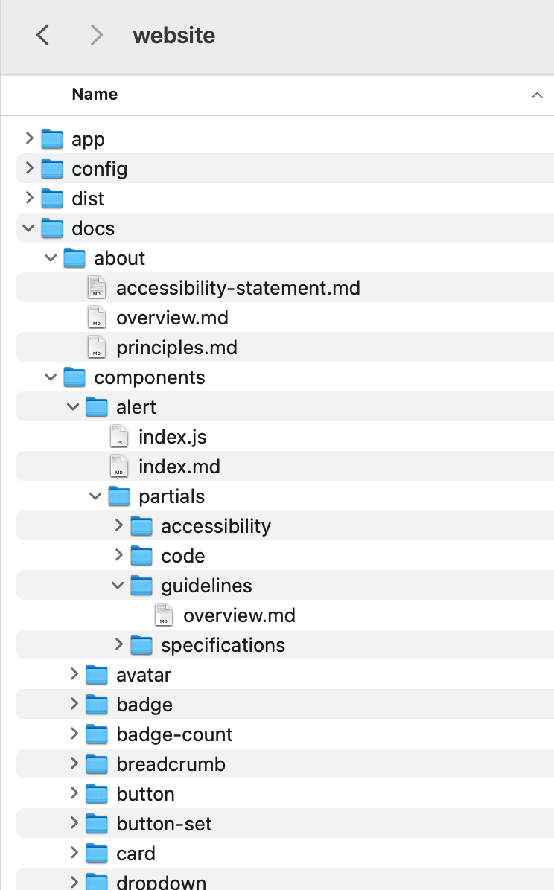

# Website / Doc folder

**Table of contents**

- [Website / Doc folder](#website--doc-folder)
  - [The `docs` folder](#the-docs-folder)
    - [Folders and files organization](#folders-and-files-organization)
    - [Markdown files](#markdown-files)
      - [Simple files](#simple-files)
      - [Index files](#index-files)
      - [Partial files](#partial-files)
      - [Content](#content)
        - [Frontmatter](#frontmatter)
        - [Sections (and "tabs")](#sections-and-tabs)
        - [Markdown](#markdown)
    - [JavaScript files ("backing class" files)](#javascript-files-backing-class-files)

---

## The `docs` folder

The folder `website/docs` in the HDS monorepo contains all the markdown files (and other related files) used to generate the documentation pages.

There are other files stored elsewhere, used to build the overall documentation, but the bulk of the website content is in this markdown-specific `doc` folder.

_For more details about the general application infrastructure, look at the [specific documentation](./Website-Infrastructure.md)._

### Folders and files organization

The `docs` folder contains a set of folders and subfolders, used to organize the content in it, and a set of files (mainly markdown, but also JavaScript) that store the actual content.

---

**IMPORTANT**

The way in which the folders and files are organized (essentially the file system) is **very** important: it represents exactly the routing and URL at which this content will be accessible. For example,
the document `./documents/about/hds-principles.md` will be available at the URL `http://.../about/hds-principles/`, the document `./docs/components/form/checkbox/index.md` will be accessible at the URL `http://.../components/form/checkbox/`, etc.

---



The direct sub-folders of `doc` represent the main sections of content and are grouped (in code) under the different top-level categories ("About", "Components", "Foundations", "Patterns", etc.).

Each one of these folders is organized internally in different ways (based on the information architecture for that section): some of them contain directly simple markdown files, others contain sub-folders and multiple markdown files (or single files or index + partial files).

### Markdown files

The entry point for each "standard" documentation page is a markdown file stored in the `docs` folder. Depending on the complexity of the content, it can be a single file, or an "index" file with "partial" sub-files.

#### Simple files

If the content of a page is relatively simple, it can all be saved in a single markdown file.

This file will need a frontmatter block (see ["frontmatter"](#frontmatter) section below).

If needed, the content can be split into sections/tabs (see [Sections and tabs](#sections-and-tabs) below).

If needed, eg. to provide data or functions/callbacks to the content, you can add a JavaScript file (see [Backing class JavaScript files](#backing-class-javascript-files)) with the same exact name as the markdown file (extension excluded): in this way it will be automatically associated to the markdown file as "backing class".

_For more details about the how this automatic mechanism works, look at the [specific documentation about the website infrastructure](./Website-Infrastructure.md)._

#### Index files

If a documentation page contains a lot of content, it's better to split it down into "partials", and include then via the `@include` syntax ([see details here](./Website-Markdown.md#import)) in a "index" file that will act as a container.

The index file will need a frontmatter block (see ["frontmatter"](#frontmatter) section below), but not its partial files.

The content should be split into sections/tabs (see [Sections and tabs](#sections-and-tabs) below).

If needed, eg. to provide data or functions/callbacks to the content, you can add a JavaScript file (see [Backing class JavaScript files](#backing-class-javascript-files)) with the same exact name as the markdown file (extension excluded): in this way it will be automatically associated to the markdown file as "backing class".

_For more details about how this automatic mechanism works, look at the [specific documentation about the website infrastructure](./Website-Infrastructure.md)._


#### Partial files

If a documentation page contains a lot of content, it's better to split it down into "partials", and include them via the `@include` syntax ([see details here](./Website-Markdown.md#import)) in an "index" file that will act as a container.

Don't add a frontmatter block, and don't add sections to it (if needed, use the parent file to add the sections).

If the code in the "partial" file needs data or functions/callbacks to the content, it should be added to the parent backing class JavaScript file (the content of the partials will all be merged in that file).

#### Content

Markdown files can contain a "frontmatter" block, markdown content (of course!), possibly split into "sections".

##### Frontmatter

A "frontmatter" block is a specific section of code (technically, YAML) stored between triple-dashed lines (`---`).

It's declared at the top of a markdown file, and used to provide additional data relevant to the page.

It's expressed as a set of key/value pairs (each value on its own line).

This is an example:

```
---
title: Alert
description: Displays a brief message without interrupting a user’s task.
caption: Displays a brief message without interrupting a user’s task.
links:
  figma: https://...
  github: https://github.com/hashicorp/...
layout:
  cover: false
  sidecar: false
navigation:
  order: 101
  keywords: ['alert', 'toast', 'notification', 'banner', 'message']
  label: Alert
  hidden: false
previewImage: assets/illustrations/components/alert.jpg
status:
  deprecated: 2.3.0
---
```

The "frontmatter" attributes that we support are the following:

*   `title`
    The title of the page, that will appear in the "cover" block; it's also used for the generation of the title in the `<head>` HTML block
*   `description`
    An optional extra description, that will appear below the title in the "cover" block
*   `caption`
    A blurb that will be used when listing the page as "card" (eg. in landing pages).
*   `status`
    Used to show a "badge" in the "cover" block of the page, next to the title
    Possible values are: `on-roadmap`, `released`, `experimental`, `code-only`, `design-only`, `deprecated` (if you need another one, speak with the HDS team)
*   `links`
    A list of links related to the page, that will appear in the page "cover" next to the title and the optional badge.
        * `figma` - a link to a Figma file/resource
        * `github` - a link to a GitHub page
*   `layout`
    Meta-information related to the layout of the page.
    * `cover`
      If the page "cover" is visible - default is `true`
    * `sidecar`
      If the page "sidecar" is visible (if not, the content will fill the entire available space) - default is `true`
*   `navigation`
    Meta-information related to the listing of the page in navigational contexts (eg. sidebar, cards).
    * `order`
      Used to control the order of the pages in navigational lists (lower value moves up the page, higher value moves it down) - default is `100`
    * `keywords`
      An optional list of keywords that the page can be found with, when a filter is applied to a list of pages.
    * `label`
      Alternative text to use in the sidebar navigation, instead of the `title` (which is used by default)
    * `hidden`
      Used to hide the page from the sidebar navigation and the lists on the landing pages - default is `false`
*   `previewImage`
    An optional full path to an image used when listing the page as "card" (eg. in landing pages). The path refers to the `dist` folder generated at build time, so is relative to the content of the `/website/public` folder.
*   `status`
    An optional status of the component (that will be reflected in the pages with specific badges next to the component card or name)
        * `deprecated` - the version number in which the component has been deprecated (in the format `x.y.z`)
        * `updated` - the version number in which the component has been updated (in the format `x.y.z`) - notice: this can be removed after some time, when the changes are not anymore recent enough to justify the extra information

Only the `title` attribute is technically required, all the others are optional (even though some of them like `description` and `caption` are necessary for component pages).

##### Sections (and "tabs")

If the content of a page is extremely long, it's possible to organize it in logical "sections" using a special syntax inside an ["index" page](#index-files).

If we take as an example the documentation page for the `Alert` component, this is a (possible) content for the "index" page:

```
---
title: Alert
---

<section data-tab="Guidelines">
  @include "partials/guidelines/overview.md"
</section>

<section data-tab="Code">
  @include "partials/code/component-api.md"
  @include "partials/code/how-to-use.md"
</section>

<section data-tab="Specifications">
  @include "partials/specifications/design-guidelines.md"
</section>

<section data-tab="Accessibility">
  @include "partials/accessibility/accessibility.md"
</section>

<section data-tab="Version history">
  @include "partials/version-history/2.3.0.md"
</section>
```

As you can see the content is "split" using `<section>` HTML elements, each one with its own `data-tab` attribute. The actual content is then imported in the file using the [`@include` special syntax](./Website-Markdown.md#include).

When the content is structured in this way, the application automatically generates a set of tabs, in the page "cover", with the order set by the order of the sections in the markdown file.

These tabs are then used to control the visibility of the different sections depending on the one that is selected, by the user, or at page load if there is an associated query parameter in the URL.

The value of the `data-tab` attribute will be used as label for the tab.

__Important: we are not enforcing in any way what these labels should and shouldn't be: we leave it to the editors to keep the tabs consistent across pages.__

##### Markdown

The actual content of the documentation pages is in markdown format (technically a superset, because it can include also HTML, handlebars and Ember code).

For details about the supported markdown syntax that you can use, refer to [the specific documentation on markdown](./Website-Markdown.md).

### JavaScript files ("backing class" files)

Whenever the content of a markdown page (simple, index or sub-page) contains Ember or Handlebars code that needs data or event handlers, it's possible to provide a "backing class" to it in the form of a JavaScript file.

The file name **must** have the exact same name as the markdown file (extensions excluded, of course) and have the structure of an [Ember "Component" class](https://api.emberjs.com/ember/release/classes/Component).

To understand how this "magic" works, you have essentially to consider the markdown file as a component's "template" and the JS file as its "backing class", with the application creating an Ember component out of it on-the-fly at runtime.

__For more details about how this automatic mechanism works, look at the [specific documentation about the website infrastructure](./Website-Infrastructure.md#dynamictemplate-component)).__

It's impossible to cover all use cases in this guide, but we provide a sample of code for reference:

```
import Component from '@glimmer/component';
import { action } from '@ember/object';
import { tracked } from '@glimmer/tracking';

import TOKENS from '@hashicorp/design-system-tokens/dist/docs/products/tokens.json';
import { SIZES } from '@hashicorp/design-system-components/components/xyz';

export default class Index extends Component {
  @tracked showHighlight = false;

  get STATES() {
    return ['default', 'hover', 'active', 'focus', 'disabled'];
  }

  get SIZES() {
    return SIZES;
  }

  get groupedTokens() {
    const groupedTokens = {};

    TOKENS_RAW.forEach((token) => {
      const category = token.attributes.category;
      if (!groupedTokens[category]) {
        groupedTokens[category] = [];
      }
      groupedTokens[category].push(token);
    });

    return groupedTokens;
  }

  @action
  noop() {
    //
  }

  @action
  toggleHighlight() {
    this.showHighlight = !this.showHighlight;
  }

  @action
  copyToClipboard() {
    console.log('Clicked "Copy to clipboard" button!');
  }

  @action
  activateModal(modal) {
    document.body.style.overflow = 'hidden';
  }
}
```

As you can see, the code is identical to the code you would find in a standard Ember component, so just apply your knowledge to it (if you don't know how to write an Ember backing class, speak with the engineers in the HDS team and they surely can help).

