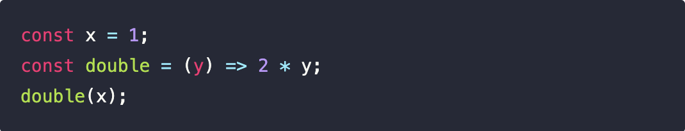
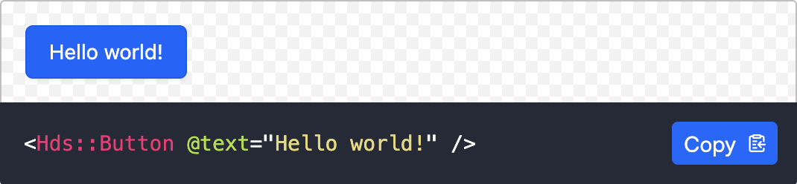
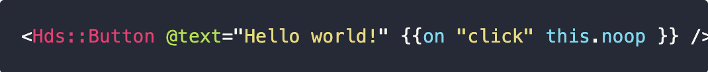

# Website / Markdown

**Table of contents**

- [Website / Markdown](#website--markdown)
  - [Supported markdown syntax](#supported-markdown-syntax)
    - [Common syntax](#common-syntax)
      - [Headings](#headings)
      - [Paragraphs](#paragraphs)
      - [Blockquotes](#blockquotes)
      - [Bold and italic](#bold-and-italic)
      - [Strikethrough](#strikethrough)
      - [Lists](#lists)
        - [Advanced lists formatting](#advanced-lists-formatting)
      - [Links](#links)
      - [Images](#images)
      - [Video](#video)
      - [Code formatting](#code-formatting)
        - [Inline code](#inline-code)
        - [Code block](#code-block)
      - [Tables](#tables)
      - [HTML in markdown](#html-in-markdown)
      - [Escaping](#escaping)
    - [Custom syntax](#custom-syntax)
      - [`@include`](#include)
      - [`Banner`](#banner)
      - [`Do/Dont`](#dodont)
    - [Examples under the “testing” pages](#examples-under-the-testing-pages)

---

## Supported markdown syntax

We use Markdown for a large part of the documentation on the website. To convert Markdown to HTML and render it in a browser we use a specific JavaScript library called [Showdown](https://showdownjs.com/). This library understands mostly all of the common Markdown flavors, but can also be extended with your own custom syntax.

### Common syntax

You can refer to the [Showdown's Markdown syntax documentation page](https://showdownjs.com/docs/markdown-syntax/) for a detailed explanation of the different formatting and syntax options.

Below we list the most common use cases you will meet while writing markdown for our documentation.

If you want to see our markdown in action we have a set of pages that we use for testing:
- [source code in Markdown](https://raw.githubusercontent.com/hashicorp/design-system/main/website/docs/testing/markdown/basic-styling.md)
- [rendered page in HTML](https://hds-website-hashicorp.vercel.app/testing/markdown/basic-styling/)


#### Headings

You can create a heading by adding one or more `#` symbols before your heading text (please add  space between `#` and the heading text). The number of `#` determines the level of the heading.

🚧 _TODO explain how IDs and anchors are generated_

#### Paragraphs

Paragraphs are one or more lines of consecutive text followed by one or more blank lines.

_Note: Showdown supports "hard-wrapped" text paragraphs. It means the following examples produce the same output:_

```
A very long line of text
```

```
A very
long line
of text
```

#### Blockquotes

You can indicate blockquotes with a `>` character at.
Blockquotes can have multiple paragraphs and can have other block elements inside.

#### Bold and italic


You can make text bold or italic.

```md
*This text will be italic*
**This text will be bold**
```

Both bold and italic can use either a `*` or an `_` around the text for styling. This allows you to combine both bold and italic if needed.


#### Strikethrough

You can apply a strikethrough line to a word or groups of words by adding two tildes (`~~`) characters around them (same syntax as GitHub).

#### Lists

We support both unordered (bulleted) and ordered (numbered) lists using the standard markdown syntax:
- prefix **unordered** list items with either `*`, `-`, or `+` (we suggest to use `-`).
- prefix **ordered** list items with a number and a dot (we suggest using consecutive numbers).

```md
- Unordered item 1
- Unordered item 2
- Unordered item 3

1. Ordered item 1
2. Ordered item 2
3. Ordered item 3
```

Note: we don't support GFM-styled takslists (`- [ ] unchecked list item`).

Even if not technically strictly required, for consistency list markers should always start at the left margin, and be followed by one or more spaces (of course, lists can be indented, in which case the list indicator will be indented too).

If the list item contains a very long text, to make the code more readable you can wrap items with so-called "hanging indents":

```md
*   Lorem ipsum dolor sit amet, consectetuer adipiscing elit.
    Aliquam hendrerit mi posuere lectus. Vestibulum enim wisi,
    viverra nec, fringilla in, laoreet vitae, risus.
*   Donec sit amet nisl. Aliquam semper ipsum sit amet velit.
    Suspendisse id sem consectetuer libero luctus adipiscing.
```

⚠️ **Important**: if one list item is separated by a blank line, Showdown will wrap all the list items in `<p>` tags in the HTML output (this differs from other Markdown implementations). So this input:


```md
* Lorem

* Ipsum
* Dolor
```

results in:

```html
<ul>
<li><p>Lorem</p></li>
<li><p>Ipsum</p></li>
<li><p>Dolor</p></li>
</ul>
```

##### Advanced lists formatting

For more advanced use cases of lists, refer to the Showdown documentation:
- [Nested lists](https://showdownjs.com/docs/markdown-syntax/#nested-lists)
- [Nested blocks](https://showdownjs.com/docs/markdown-syntax/#nested-blocks)
- [Nested code blocks](https://showdownjs.com/docs/markdown-syntax/#nested-code-blocks)

**Note**: we don't support GFM-styled takslists (`- [ ] unchecked list item`).

#### Links


You can create an inline text link by wrapping the text in brackets `[ ]`, and then wrapping the link in parentheses `( )` . For example:

```
[HashiCorp!](https://hashicorp.com)
```

_Tip: if you can't remember which parenthesis to use, think of the link as a function, in which the URL is the argument ;)_

Showdown supports alternative syntaxes for links, but for consistency we prefer to use only the one above, which is the most common one.

#### Images

The syntax to add an image to markdown looks like this:

```md
 // not accessible, avoid!


```

If you need, for example, to scale down a larger image to a specific size, you can define the image dimensions like this:

```md


This assumes units are in px. If you want you can use more specific size declarations:

```md
    // width = 100px / height = "auto"
  // width = 80% / height = 5em
```

Since Markdown supports also HTML content, if necessary it's possible to use directly an HTML `` tag to add an image to the content:

```md
Some text content here


Some other content here
```

#### Video

Video assets are not natively supported in markdown, but you can easily insert an MP4 or similar file type into a markdown file with a basic understanding of HTML:

```md
<video width="100%" controls loop>
  <source
    src="/assets/[components][patterns]/{name-of-component-or-pattern}/{path-to-video-file}.mp4"
    type="video/mp4"
  />
</video>
```

This example uses the native HTML video tag with a couple of key attributes:

- `controls` indicating that the video player should display "play", "pause", "volume", and other basic controls.
- `loop` indicating that the video asset should loop when it reaches the end (this can be useful for shorter examples).

The `<source>` tag accepts the absolute file path (starting with a "/") in relation to the "/website/public/assets" base folder and the type of file.

It’s recommended that you stick to MP4 files as they are the best optimized for all browsers.

#### Code formatting

##### Inline code

Single backticks (<code>`</code>) are used to style inline text as code.

The text within the opening and closing single backticks appears in a special monospace format, inline with the rest of the text itself.

```md
This is some text and `this is some code` within this text.
```

This is rendered as "inline code" (`<code>` inline with the text):


You can use backticks in any form of inline text (eg. in heading too).

##### Code block

Triple backticks (<code>```</code>) are used instead to style text as its own distinct block.

```
const x = 1;
const double = (y) => 2 * y;
double(x);
```

This is rendered as a simple "code block":



Using different language syntax identifiers, it's possible to have specific syntax highlighting for the code block. The most frequently used are
- ```` ```md ```` → markdown
- ```` ```js ```` → JavaScript
- ```` ```css ```` → CSS/Sass
- ```` ```markup ```` → HTML-like code
- ```` ```handlebars ```` → Handlebars code

The last one, `handlebars`, is a special one for our application: it's used to identify code blocks that need to be executed and rendered at run time, with a preview of the executed code and the code block below.

This code snippet:

```handlebars
<Hds::Button @text="Hello world!" />
```

is compiled at runtime and rendered as:



The code block will automatically contain a "Copy" button, that the reader can use to copy the exact same code shown in the block.

If you want to show handlebars code without actually executing it, you have to use this special syntax:

```handlebars{data-execute=false}
<Hds::Button @text="Hello world!" {{on "click" this.noop }} />
```

and it will render as:




#### Tables

Tables aren't part of the core Markdown spec, but are supported by Showdown using the [GitHub Flavored Markdown (GFM)](https://github.github.com/gfm/#tables-extension-).

The syntax can easily become quite complex (to write, read, review, and maintain) so we suggest to use table sparingly and intentionally:

```md
| Tables            | Are                | Cool  |
| ----------------- |:------------------:| -----:|
| column 1 is       | is left aligned    | $1600 |
| column 2 is       | is *centered*      |   $12 |
| **column 3 is**   | is right aligned   |    $1 |
| `inline elements` | can be added too   |     - |
|  | as well as images  |     - |
```

Refer to te official GFM specifications for details about the syntax to use: [https://github.github.com/gfm/#tables-extension-](https://github.github.com/gfm/#tables-extension-)

Notice: similar to images, HTML `<table>` elements can be used in Markdown. This can be an escape hatch when using the syntax above becomes too complex, or the content of the table includes "block" elements (eg. code snippets, multi-line markdown elements, structured Ember components, etc.)

#### HTML in markdown

As mentioned above, it's possible to add HTML element to markdown. Showdown generally leaves HTML tags untouched in the output document, but this can't always be assured (eg. the content of `<code>` and `<pre><code>` tags is always escaped) so we suggest to limit the use of HTML in markdown to only those cases where it's absolutely necessary.

If you need to structure the content in a specific layout, before starting to use tables or `<div>` elements with inline styles, consider if there are alternative ways to present and organize the same content, following the markdown intrinsic nature (content flows vertically) or reach out to the HDS team to see what options you may have.

#### Escaping

It's possible to escape characters that have special meaning in markdown's syntax (and generate literal characters instead) prefixing them with a backslash (`\`).


For example, if you want to surround a word with literal underscores (that otherwise would be converted to an HTML `<em>` tag), you would do this:

```md
\_literal underscores\_
```

Showdown provides backslash escapes for the following characters:

```
\   backslash
`   backtick
*   asterisk
_   underscore
{}  curly braces
[]  square brackets
()  parentheses
#   hash mark
+   plus sign
-   minus sign (hyphen)
.   dot
!   exclamation mark
```

It's also possible to escape HTML tags using this special syntax:

```md
\<div>a literal div\</div>
```

But we **strongly** suggest to simply convert the tags to normal strings using the HTML `&lt;` (`<`) and `&gt;` (`>`) entities:

```md
&lt;div&gt;a literal div\&lt;/div&gt;
```

---

### Custom syntax

To support our special "editorial" needs, we have extended the markdown syntax interpreted by Showdown with a set of special custom syntaxes.

#### `@include`

One of the problems we wanted to solve with the new HDS website was single-file documentation pages consisting of hundreds/thousands of lines of code. For this reason, we have added a special syntax to "import" partial content in markdown files:

```
@include "path/to/file.md"
```

In this way it's possible to split the content of a documentation page in multiple "partial" files and have an "index" file that imports at compilation/build time, by including their content in the same location in code where the `@import` is declared.

⚠️ **Important**: The files to be included **must** live under a folder called `partials` (so the compiler knows doesn't consider them as standalone pages). Inside this folder, they can be organized in any way (they can be direct children, or be grouped in folders).

While _in theory_ this syntax should work in any context and in any markdown file, the **only** intended use at the moment is inside an `index.md` file, to organize the content of the page in different splitted sub-files.

For more details about how the markdown files are organized and structured under the `docs` folder refer to the [`Doc` folder](../Website-Doc-folder.md) documentation

#### `Banner`

To allow editors to add informational banners in the content, without the need to use a custom Ember component (and to know its custom syntax) we have introduced a special syntax based on a custom delimiter made of three exclamation marks:

```md
!!! Info

**Banner title**

Lorem ipsum dolor sit amet ... vulputate purus in.
!!!
```

This **custom content block** of markdown will render as:


The text after the opening `!!!` delimiter defines the visual styling of the banner. The available options are:

- Info or Information
- Success
- Warning
- Critical
- Insight

To see how the different variants are rendered [refer to this page](https://hds-website-hashicorp.vercel.app/testing/components/banner/).

Notice: the text is not case-sensitive, so you can use both `Info` and `info` but we suggest using the capitalized version, for consistency.

The isolated **`**strong**`** element is, by convention, considered the "title" of the banner and styled accordingly. It's optional, so if you want to have just plain text it can be omitted.

The content of the banner can be almost anything (just try and see if it works, if needed) but we suggest keeping thing simple, so use only paragraph, lists, links, etc.


#### `Do/Dont`

Using the same syntax, but with a slightly different block identifier, it's possible to have Do/Dont blocks.

```
!!! Do

Your content here.
!!!

!!! Dont

Your content here.
!!!
```

This **custom content block** of markdown will render as:


**Important**: leave an empty newline after the opening delimiter, to allow the markdown parser to identify correctly the custom content block.

---
### Examples under the “testing” pages

You can see a set of examples of markdown under [the "testing" section of the website](https://hds-website-hashicorp.vercel.app/testing) (you can [look at the source code in the repository](https://github.com/hashicorp/design-system/tree/main/website/docs/testing), to compare the markdown used as an input and the HTML generated and rendered in output).
