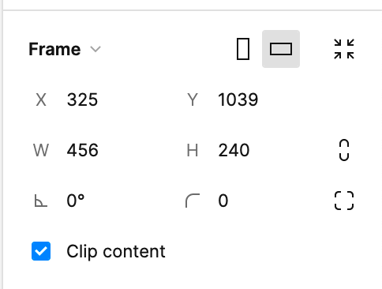
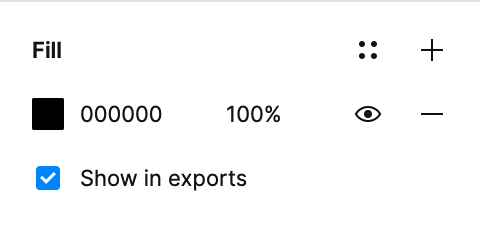

# Website / Media

- [Website / Media](#website--media)
  - [Where to store the media files](#where-to-store-the-media-files)
  - [Where to find the source for the media files](#where-to-find-the-source-for-the-media-files)
  - [How to export the files](#how-to-export-the-files)
  - [Optimizing images](#optimizing-images)
  - [Adding and optimizing video assets](#adding-and-optimizing-video-assets)

---

## Where to store the media files

At the time of writing, the only way for a markdown file to "consume" an image (or media file in general) is if the image is stored in the `website/public` folder, which is cloned at build time into the `dist` folder. It's not super ergonomic, and we're considering the possibility to change our build pipeline so that relative paths to images are allowed (and work as expected), but at the moment is still considered a non-blocking improvement.

## Where to find the source for the media files

All the assets used in the website are collected under [the Figma file "Website assets"](https://www.figma.com/file/42LK10XbP5IERhzzgMOiI2/Website-assets?node-id=0%3A1&t=xf7eqxGJEBopQM5d-0).

Please add the original source of every image or illustration that you add to the documentation, so that it's easy to find and change if necessary.

## How to export the files

As mentioned above, the generated files should be exported in the `website/public` folder.

Regarding the format and settings of the "Export" panel in Figma, please follow these guidelines:

- assets should be ready to be exported as they are, without the need for someone to do something
  - give them frame the exact name that will be used in the code
    - no uppercase, no space, no slash, no special characters (eg. `this-is-my-file`)
    - choose how the asset should be exported: the resolution (generally will be `@2x`) and the format (`SVG`, `PNG`, `JPG`, depending on the context)
      - consider the content of the image
        - it’s just vectors, with normal paths? probably an `SVG` is best
        - it’s vectors, but with thousands of points? export in `SVG` and `PNG` and compare the size, then choose
        - it’s both vectors and bitmap (eg. the new illustrations)? then `JPG` is the one that compress better
  - decide if the frame should be clipped or not (generally is not necessary if it’s `SVG`, but if it’s `JPG` is better because in some cases it may create visual artifacts on the borders)
    - 
  - decide if the background color applied to the frame should be exported or not (if it’s `SVG` almost certainly not, if it’s `PNG` or `JPG` almost certainly yes)
    - 
- consider the frame size in relation to what is the real use case
  - is it a fixed size in the page? use the exact same size (and export at `@2x`)
  - is it an image that resizes when the viewport changes? speak with the developer and decide what is the right size to use

If you have any doubts or problems exporting the files, speak with one of the designers of the HDS team.

## Optimizing images

Prior to adding new images to the website, the assets should be optimized to reduce file sizes and increase web performance. Figma’s export feature doesn’t allow for fine-grained control regarding image quality and optimization for the web. [ImageOptim](https://imageoptim.com) is free, works great, and is easy to use. And with the correct settings, it can result in a more than _50% reduction_ in file size per image.

1. Install the desktop app for your specific operating system.
2. Open the application settings and ensure that the settings match the recommended optimization settings:
    1. In the quality tab, enable "Lossy minification"
    2. Set the image qualities for JPG, PNG, and GIF files to 85–90%. This results in a high-quality, high-resolution image while removing unnecessary metadata and compressing the file size for the web.
3. Add images either using the plus icon in the lower left corner or by dragging and dropping files from your file browser into the window.

Once added to the queue, ImageOptim will automatically optimize and save the assets. **Warning:** This will overwrite the original files.

## Adding and optimizing video assets

Providing video examples in documentation can be helpful for explaining complex concepts in a step-by-step manner, but these types of assets require a bit more work to create and subsequently include in markdown.

_Video assets (MP4, MOV, etc.) aren’t directly supported by markdown. For more details on how to include them, see the [markdown documentation](/wiki/Website-Markdown.md)._

These steps are specific to the workflow between Adobe After Effects, Premiere, and Adobe Media Encoder. You will need to seek approval from your manager and request a license from IT to gain access to these applications. More complex examples (creating a custom UI in After Effects, more in-depth editing, etc) are beyond the scope of this guide.

1. Create your source video, for example, of an in-browser experience or a Figma prototype; the most straightforward method is to [record your screen using Quicktime’s native screen recording feature](https://support.apple.com/en-gb/guide/quicktime-player/qtp97b08e666/mac).
2. After launching Media Encoder, add your asset to the render queue.
    1. In After Effects, this can be done through the "Composition" menu by selecting "Add to Media Encoder Render Queue…" (Alt + Cmd + m).
    2. In Premiere, under the "File" menu, choose "Export -> Send to Adobe Media Encoder" (Cmd + Shift + m).
    3. To add directly to Media Encoder, click the "+" button in the Queue panel to "Add source".
3. Click the Format of the asset to access Export Settings.

4. Under the Export Settings, select H.264 as the format which renders an MP4 file and is appropriate for web. You can also optionally select the output location and name of the rendered asset.

5. Under "Basic Video Settings" in the Export Settings window, set the width of the rendered asset to 1200px or less and the frame rate to 15 fps. The width can depend on the original asset, but I’ve found this to be a happy medium for file size and quality.

6. With all of these settings applied, click the green triangle "play" button at the top of the queue to kick off the render process which will render all files in the queue (if there are more than one).